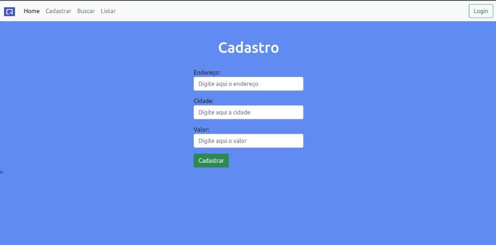

### README

<h1 align='center'> Site de imóveis em Flask </h1>

 <b>Flask e MYSQL </b>

### Funcionalidades

- [x] Cadastrar imóvel através das informações dadas pelo usuário
- [x] Buscar endereço atráves da busca feita pelo usuário 
- [x] Listar os endereços disponíveis no banco de dados 
- [x] Editar e Deletar imóveis
- [x] Login e Registro de usuários 

### Screenshot
<h1> 
 
</h1>